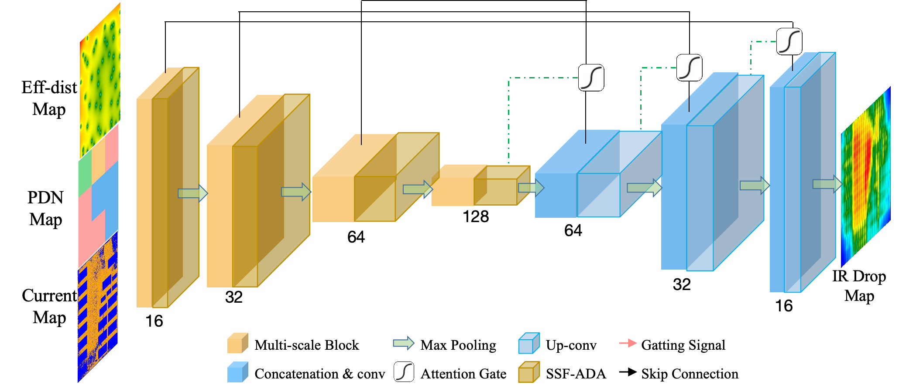

# MAUnet

## Correction

In Figure 2 of our published paper, due to an oversight, there were inaccuracies in the network architecture. We have now updated the figure as shown below.

*"This correction does not affect the core conclusions of the study. We sincerely apologize for any confusion this may have caused."*

## Data Source

The three benchmarks we used in this work originate from https://github.com/UMN-EDA/BeGAN-benchmarks/tree/master.
The data include information on three different technology nodes: 7 nm, 45 nm, and 135 nm. Additionally, these data are divided into two parts: real data and fake data. The real data is generated using circuit information from the open-source OpenROAD project, while the fake data is generated through GAN (Generative Adversarial Network) networks.

## Data Source

The three benchmarks we used in this work originate from https://github.com/UMN-EDA/BeGAN-benchmarks/tree/master.
The data include information on three different technology nodes: 7 nm, 45 nm, and 135 nm. Additionally, these data are divided into two parts: real data and fake data. The real data is generated using circuit information from the open-source OpenROAD project, while the fake data is generated through GAN (Generative Adversarial Network) networks.

## Introduction

🤔🤔🤔

This is the code implementation of the paper “MAUnet: Multiscale Attention U-Net for Effective IR Drop Prediction”
The structure of the project is as follows：

-- MAUnet

-- MAUnet_exf

-- baseline1

-- baseline1_exf

-- generate_feature

-- plot_fig

Among them, **MAUnet** is the main implementation of the model proposed in the paper, and **MAUnet_exf** is the implementation of adding additional extracted features proposed in the paper.

**baseline1** and **baseline1_exf** are also the experimental codes of the corresponding baseline models.

**genarate_feature** is the relevant code for extracting features from the netlist file .sp, and **plot_fig** is the drawing program related to the paper.

## Requirements

🥸🥸🥸

This project bases on Python 3.8.13.

More information about packages can be found in **requirements.txt**.

## Usage

😇😇😇

Taking the **MAUnet** as an example, you can train the model using the following command:
>**python3 train_asap7.py --normal True --epoch 400 --lr 0.001 --path sky130hd_seed3 --seed 3**
>
>--normal  normlize
>
>--epoch  training epoch
>
>--lr learning rate
>
>--path the path to save model
>
>--seed random seed

The testing command is:

>**python3 test_asap7.py --model asap7_seed3 --tdir asap7_seed3**
>
>--model  the path of testing model
>
>--tdir the dirctiory to save testing results

By the way , you can execuate the following command to finetune trained model:

>**python3 finetune_130to45.py --num 2 --seed 5**
>
>--num  the number of fintuning cases
>
>--seed random seed

## Docs

🥳🥳🥳

The paper is published on [DAC '24: Proceedings of the 61st ACM/IEEE Design Automation Conference](https://dl.acm.org/doi/proceedings/10.1145/3649329)
